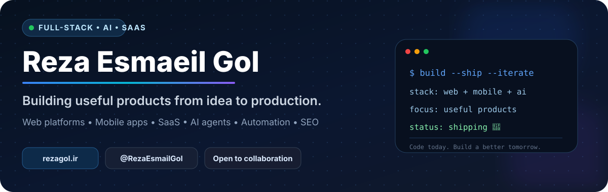
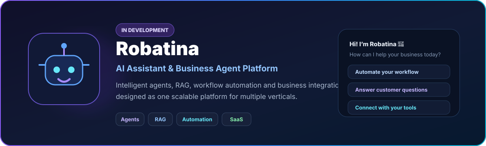
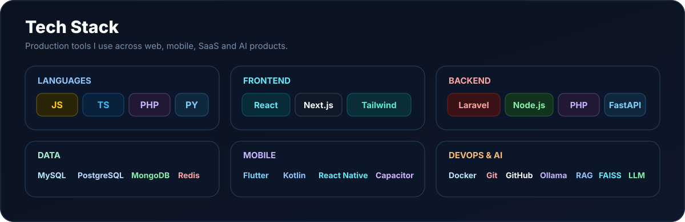
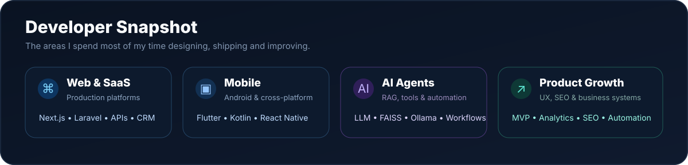

<div align="center">



<br />

### Full-Stack Developer · AI & SaaS Builder · Mobile · SEO

**I turn real business problems into production-ready software.**

<p>
  <a href="https://rezagol.ir"></a>
  <a href="https://www.linkedin.com/in/reza-esmaeil-gol-610b1355"></a>
  <a href="https://github.com/RezaEsmailGol"></a>
</p>

<p>
  
  
  
  
  
  
  
</p>

</div>

---

## 👋 About Me

<table>
<tr>
<td width="62%" valign="top">

I'm **Reza Esmaeil Gol**, a full-stack web and mobile developer focused on building useful products from idea to production.

- 🚀 Product development: **idea → architecture → UI/UX → development → deployment**
- 🤖 AI assistants, agents, RAG, semantic search and workflow automation
- 🌐 SaaS platforms, dashboards, e-commerce and SEO-focused systems
- 📱 Android, Flutter, Kotlin and React Native applications
- ⚙️ Performance, scalable architecture and business automation

</td>
<td width="38%" valign="top">

### Current focus

`AI Agents`  
`SaaS Products`  
`Local + Cloud LLM`  
`Automation`  
`SEO & Search`  
`Mobile Products`

**Build useful things. Ship. Learn. Improve.**

</td>
</tr>
</table>

---

## ✨ Featured Open Source — لحن من

<a href="https://github.com/RezaEsmailGol/lahne-man">
  
</a>

<div align="center">

### 🪶 [Lahne Man — لحن من](https://github.com/RezaEsmailGol/lahne-man)

**ویرایش طبیعی متن فارسی، بدون از بین بردن لحن واقعی نویسنده**

<p>
  <a href="https://github.com/RezaEsmailGol/lahne-man/stargazers"></a>
  <a href="https://github.com/RezaEsmailGol/lahne-man/network/members"></a>
  <a href="https://github.com/RezaEsmailGol/lahne-man/blob/main/LICENSE"></a>
  
</p>

</div>

**Lahne Man** is an open-source Persian writing skill that reduces repetitive, machine-like writing patterns while preserving the writer's personal voice, technical details and natural rhythm.

```bash
npx skills add RezaEsmailGol/lahne-man --skill lahne-man --global --yes
```

> اگر فارسی می‌نویسی و نمی‌خواهی متن شبیه خروجی کلیشه‌ای هوش مصنوعی شود، «لحن من» برای همین ساخته شده است.

**→ [View project, documentation and examples](https://github.com/RezaEsmailGol/lahne-man)**

---

## 🚧 Currently Building



**Robatina** is an AI assistant and business-agent platform built around RAG, workflow automation, tool integrations, long-term memory and local/cloud model routing.

---

## ⚡ Tech Stack



---

## 🧠 Developer Snapshot



---

## ⭐ Selected Products

<table>
<tr>
<td width="50%" valign="top">

### 🌐 RezaGol
My personal product studio, portfolio and academy for web, mobile, SaaS and AI projects.

**Next.js · Laravel · AI · SEO**  
[rezagol.ir](https://rezagol.ir)

</td>
<td width="50%" valign="top">

### 🤖 Robatina
AI assistants and business agents with RAG, workflow automation, memory and tool integrations.

**Python · FastAPI · Ollama · FAISS · Agents**

</td>
</tr>
<tr>
<td width="50%" valign="top">

### 🦺 HSEBAN
HSE SaaS platform for safety workflows, CAPA, risk management, experts, jobs and business operations.

**SaaS · HSE · Automation · Analytics**  
[hseban.ir](https://hseban.ir)

</td>
<td width="50%" valign="top">

### 🧾 SoratYar
Invoice and product-sharing SaaS with OTP access, public invoices and online payment flows.

**Next.js · Prisma · MySQL · Payments**  
[soratyar.ir](https://soratyar.ir)

</td>
</tr>
<tr>
<td width="50%" valign="top">

### 🛋️ RayanMobl
Furniture e-commerce platform focused on search, product discovery and online ordering.

**Next.js · PHP API · E-commerce · SEO**  
[rayanmobl.ir](https://rayanmobl.ir)

</td>
<td width="50%" valign="top">

### 🔭 Exploring Next

- Multi-agent business automation
- Long-term memory for assistants
- Human approval + tool execution
- Local/cloud model routing
- AI-native CRM and commerce
- Reliable mobile AI experiences

</td>
</tr>
</table>

---

## 🧩 What I Build

<table>
<tr>
<td width="25%" valign="top">

### 🌐 Web & SaaS
Custom platforms  
Admin dashboards  
CRM & billing  
E-commerce  
SEO-first websites

</td>
<td width="25%" valign="top">

### 📱 Mobile
Android  
Flutter  
Kotlin  
React Native  
PWA / Hybrid

</td>
<td width="25%" valign="top">

### 🤖 AI
AI agents  
RAG  
Local LLM  
Automation  
Tool integrations

</td>
<td width="25%" valign="top">

### 📈 Product
MVP → production  
Architecture  
UX  
Analytics  
Performance

</td>
</tr>
</table>

---

## 🧠 Primary Languages


---

## 🔓 Open Source

<div align="center">

<a href="https://github.com/RezaEsmailGol/lahne-man"></a>
<a href="https://github.com/RezaEsmailGol/wp-booster"></a>
<a href="https://github.com/RezaEsmailGol/vertical-sidebar"></a>
<a href="https://github.com/RezaEsmailGol/Portfolio-website-multi-langual"></a>

</div>

Most commercial products and client systems are kept private; public repositories focus on open-source tools, experiments and reusable work.

---

## 🐍 Contribution Energy


---

## 🤝 Let's Connect

<div align="center">

### Building something useful?

I'm open to **product collaborations, technical challenges, AI/SaaS projects and engineering opportunities**.

[🌐 **rezagol.ir**](https://rezagol.ir) · [💼 **LinkedIn**](https://www.linkedin.com/in/reza-esmaeil-gol-610b1355) · [▶️ **YouTube**](https://www.youtube.com/@rezagol_ir) · [📷 **Instagram**](https://instagram.com/rezagol.ir)

<br />

**Code. Build. Ship. Improve.** 🚀

</div>
