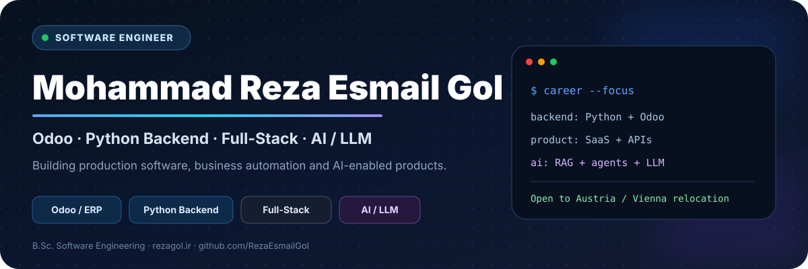
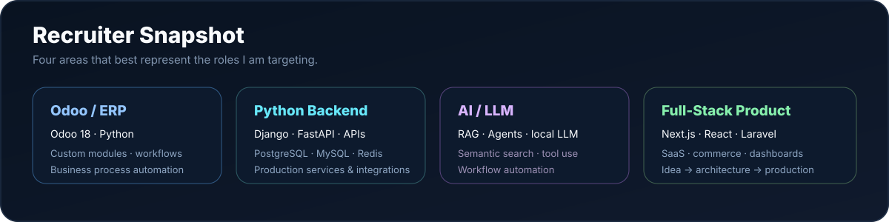
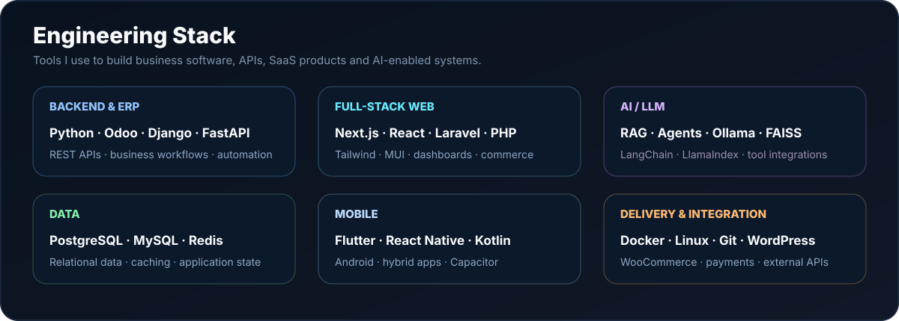

<div align="center">



<br />

<a href="https://rezagol.ir"></a>
<a href="https://www.linkedin.com/in/reza-esmaeil-gol-610b1355"></a>
<a href="https://github.com/RezaEsmailGol"></a>

<br /><br />

**Software Engineer · Odoo Developer · Python Backend · Full-Stack · AI / LLM**

**B.Sc. Software Engineering · Open to relocation to Austria / Vienna**

[English](#english) · [فارسی](#فارسی)

</div>

---

<a id="english"></a>

## 👋 Hello

I'm **Mohammad Reza Esmail Gol**, a software engineer who builds production-ready business software from idea and architecture through implementation, integration and deployment.

My current job-search focus is:

**Odoo Developer · Python Developer · Backend Developer · Software Developer · Full-Stack Developer · AI / LLM Engineer**

I enjoy work where software has a clear operational impact: **ERP and business workflows, APIs, SaaS products, automation, AI assistants, payments, commerce and data-driven systems**.

---

## 🎯 Recruiter Snapshot



| Area | What I work with |
|---|---|
| **Odoo / ERP** | Odoo 18, Python, custom modules, workflow customization, business-process validation |
| **Python Backend** | Django, FastAPI, REST APIs, PostgreSQL, MySQL, Redis, integrations |
| **AI / LLM** | AI agents, RAG, semantic search, Ollama, FAISS, LangChain, LlamaIndex, tool integrations |
| **Full-Stack** | Next.js, React, Laravel, PHP, Tailwind/MUI, dashboards, SaaS and e-commerce |
| **Mobile** | Flutter, React Native, Kotlin, Android, Capacitor |
| **Delivery** | Docker, Linux, Git, WordPress/WooCommerce integrations, payment and external APIs |

---

## 🚀 Selected Work

<table>
<tr>
<td width="50%" valign="top">

### 🤖 Robatina
Business automation and AI-agent platform built around practical customer workflows.

**Highlights**
- Customer 360 and CRM
- Unified communication workflows
- Billing and notification flows
- AI assistants, RAG and tool integrations
- Telegram / Bale business automation
- WooCommerce and service connectors

**Stack:** Python · FastAPI · AI Agents · RAG · Redis · MySQL

</td>
<td width="50%" valign="top">

### ⚙️ Odoo / ERP Work
Odoo 18 configuration, testing and customization for real business processes.

**Highlights**
- Python-based customization
- Department / employee workflow validation
- Business rules and process testing
- ERP research and implementation planning
- Integration-oriented backend work

**Focus:** Odoo · Python · PostgreSQL · ERP workflows

</td>
</tr>
<tr>
<td width="50%" valign="top">

### 🦺 HSEBAN
SaaS platform for health, safety and environment operations.

**Highlights**
- Safety workflows and CAPA
- Risk and operational processes
- Dashboards and business automation
- Multi-module SaaS architecture

**Focus:** SaaS · Automation · Analytics · Business software

</td>
<td width="50%" valign="top">

### 🧾 Commerce & Payment Systems
Web products and integrations for orders, payments and customer flows.

**Highlights**
- WooCommerce connectors
- Payment gateway integrations
- Wallet / checkout workflows
- OTP and public invoice flows
- SEO-aware product platforms

**Stack:** Next.js · Laravel/PHP · MySQL · APIs · Payments

</td>
</tr>
</table>

> Most commercial and client projects are private. Public repositories are used for open-source tools, reusable work and selected experiments.

---

## ✨ Featured Open Source — Lahne Man / لحن من

<div align="center">

<a href="https://github.com/RezaEsmailGol/lahne-man">
  
</a>

### 🪶 [Lahne Man — لحن من](https://github.com/RezaEsmailGol/lahne-man)

**Open-source Persian writing skill for more natural AI-assisted writing while preserving the author's voice.**

<a href="https://github.com/RezaEsmailGol/lahne-man/stargazers"></a>
<a href="https://github.com/RezaEsmailGol/lahne-man/network/members"></a>
<a href="https://github.com/RezaEsmailGol/lahne-man/blob/main/LICENSE"></a>

</div>

```bash
npx skills add RezaEsmailGol/lahne-man --skill lahne-man --global --yes
```

**→ [Project, documentation and source code](https://github.com/RezaEsmailGol/lahne-man)**

---

## 🧰 Engineering Stack



<p align="center">
  
  
  
  
  
  
  
  
  
  
  
  
</p>

---

## 🧭 How I Work

- **Business-first engineering:** I start from the workflow and the real operational problem.
- **End-to-end ownership:** architecture, UI, backend, integrations, testing and deployment.
- **Practical AI:** I use LLMs when they improve a workflow, not just to add an AI label.
- **Integration mindset:** APIs, payments, messaging, WooCommerce, ERP and external services.
- **Production focus:** maintainability, performance, validation and reliable delivery.

---

## 🎓 Education & Mobility

- **Bachelor's Degree in Software Engineering** — Islamic Azad University, Qom Branch, Iran
- **Based in:** Qom, Iran
- **Relocation:** open to **Vienna / Austria**
- **Work authorization:** Non-EU applicant; Austrian work permit / employer sponsorship required
- **Languages:** Persian (native), English (B2), German (actively learning)

---

<a id="فارسی"></a>

## 🇮🇷 درباره من

من **محمدرضا اسماعیل‌گل**، مهندس نرم‌افزار و توسعه‌دهنده وب و بک‌اند هستم. تمرکز فعلی من برای فرصت‌های شغلی بین‌المللی روی **Odoo، Python Backend، توسعه Full-Stack و AI/LLM** است.

در پروژه‌ها معمولاً از مرحله تحلیل مسئله و طراحی معماری تا توسعه، اتصال سرویس‌ها، تست و استقرار همراه محصول هستم. تجربه من بیشتر در **نرم‌افزارهای کسب‌وکاری، SaaS، اتوماسیون، API، سیستم‌های پرداخت، فروشگاه اینترنتی، دستیارهای هوشمند و RAG** شکل گرفته است.

### حوزه‌های کاری مورد علاقه
**Odoo Developer · Python Developer · Backend Developer · Software Developer · Full-Stack Developer · AI / LLM Engineer**

برای فرصت شغلی در **اتریش، به‌خصوص وین** آماده جابه‌جایی هستم.

---

## 🤝 Contact

<div align="center">

**Open to software engineering opportunities, especially in Austria and Europe.**

[🌐 Portfolio](https://rezagol.ir) · [💼 LinkedIn](https://www.linkedin.com/in/reza-esmaeil-gol-610b1355) · [💻 GitHub](https://github.com/RezaEsmailGol)

<br />

**Build useful software. Solve real problems. Ship reliably.**

</div>